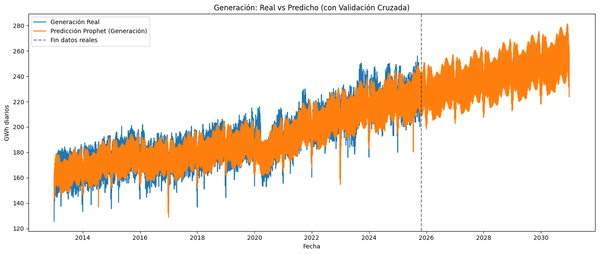
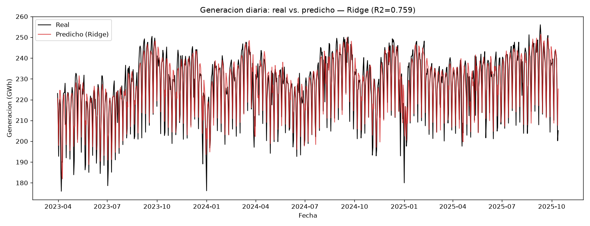
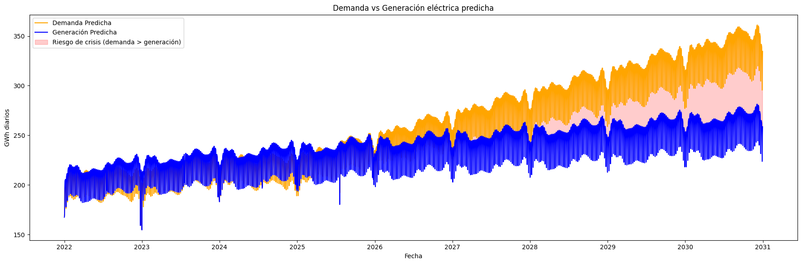

# ⚡ Electrical Energy Demand and Generation Analysis and Forecasting in Colombia

Exploratory analysis, cleaning, and **predictive time series modeling** of the
Colombian electrical system (demand, generation, and capacity), with an
**interactive Streamlit application** that walks through the full pipeline: from
raw data to energy policy conclusions.

> Project developed during the **Bootcamp de Análisis de Datos de Talento Tech
> (MinTIC)** within the **Energy Transition** track, and reorganized for
> portfolio. See [Team](#-team).

🔗 **Live demo:** [proyectoenergiaelectricacol.streamlit.app](https://proyectoenergiaelectricacol.streamlit.app/)

---

## 📑 Table of contents

- [Context and motivation](#-context-and-motivation)
- [Objective](#-objective)
- [Methodology](#-methodology)
- [Main results](#-main-results)
- [Conclusions and recommendations](#-conclusions-and-recommendations)
- [Technologies](#-technologies)
- [Project structure](#-project-structure)
- [How to run it](#-how-to-run-it)
- [App contents](#-app-contents)
- [Notebooks](#-notebooks)
- [References and sources](#-references-and-sources)
- [Team](#-team)
- [License](#-license)

---

## 🌎 Context and motivation

The Colombian energy system faces the challenge of ensuring a **reliable,
sustainable, and competitive** supply in a context of **growing electrical
demand** and a **transition toward renewable sources**. Proper planning of
demand and generation is key to anticipating imbalances and guiding
infrastructure investments.

The core problem: according to **UPME**, electrical demand will grow on average
**~2.38 % annually until 2038**, while new firm and renewable capacity does not
necessarily come online at the required pace. This tension between **rising
demand** and **supply that may not keep up** creates the risk of a **structural
deficit from 2027**.

**Why this project?** To use official historical data (SIMEM and PARATEC/XM)
and time series models to **quantify the gap between demand and generation**,
identify the moments when projected demand would exceed generation, and provide
an analytical tool for medium-term energy planning decisions.

---

## 🎯 Objective

Forecast national **daily** electrical **demand** and **generation** from
official historical data, with a **2026–2030** horizon, to identify potential
**operational deficit scenarios** (energy crisis): the days when projected
demand would exceed projected generation.

> **Scope and limitations.** The project focuses on **forecasting** generation
> and demand; it does **not** include operational/prescriptive recommendations
> or exogenous variables such as climate, population growth, prices, or future
> capacity projects (except for expected solar energy growth). The analysis
> focuses on the **demand–generation gap**.

---

## 🧭 Methodology

The project follows an end-to-end pipeline, reproduced both in the
[notebooks](#-notebooks) and in the [Streamlit application](#-app-contents):

```text
┌──────────────────────┐
│ 1. Raw data          │  SIMEM (actual generation and demand) + PARATEC/XM (capacity)
└──────────┬───────────┘
           ▼
┌──────────────────────┐
│ 2. Transformation    │  Date standardization (YYYY-MM-DD), unit conversion
│                      │  to GWh, and daily national aggregation
└──────────┬───────────┘
           ▼
┌──────────────────────┐
│ 3. Quality/outliers  │  Nulls, duplicates, and temporal continuity; IQR-based
│                      │  outlier detection and replacement of extremes with a central value
└──────────┬───────────┘
           ▼
┌──────────────────────┐
│ 4. Modeling          │  Two independent Prophet models (demand and generation)
│                      │  with holidays as regressors; supporting ML for generation
│                      │  (lags of 1/7/14/30 days + calendar)
└──────────┬───────────┘
           ▼
┌──────────────────────┐
│ 5. Comparison        │  Projected demand vs. generation and identification of
│                      │  risk dates (demand > generation)
└──────────┬───────────┘
           ▼
┌──────────────────────┐
│ 6. Conclusions       │  Deficit risk assessment and recommendations
└──────────────────────┘
```

**Validation.** Prophet **time series cross-validation (walk-forward)** was
used, with an initial window of **730 days**, retraining every **180 days**,
and an evaluation horizon of **365 days**, measuring MAE, RMSE, and sMAPE.

**Data.** The generation series covers from **Jan 1, 2022 to Oct 13, 2025**
(1,382 days, average ≈ **221.94 GWh/day**). National holidays were included
as regressors.

---

## 🔑 Main results

| Model (Prophet) |   R²   | sMAPE (short → long) |
| :-------------- | :----: | :------------------: |
| Generation      | `0.77` |    3.2 % → 5.8 %    |
| Demand          | `0.22` |    2.3 % → 8.1 %    |

- **Generation** — **robust** model, suitable for prediction and comparative analysis.
- **Demand** — **acceptable** for trend and baseline scenarios after outlier cleaning.



> **Honest note on the demand R²:** it is low because the series is short and
> very volatile at the daily level. It is useful for trend analysis (the
> short-term error is low, sMAPE ≈ 2.3 %), but for greater accuracy the next
> step would be to incorporate **exogenous variables** (climate, regional
> holidays, economic activity) or weekly/monthly aggregation.

As a complementary approach to Prophet, several regression models were compared
(Ridge, HistGradientBoosting, XGBoost, LightGBM) for generation. The best was
**Ridge** (R² ≈ 0.76, MAE ≈ 5.3 GWh):



### 🚨 Central finding

When comparing the daily generation and demand forecasts, the model projects
that **from 2026 demand exceeds generation on virtually every day**, with a
**gap that grows year after year** (from ≈ 13 GWh/day in 2026 to ≈ 72 GWh/day
in 2030). In total, the file
[`results/fechas_riesgo_crisis_energetica.csv`](results/fechas_riesgo_crisis_energetica.csv)
lists **2,123 dates** (2022–2030) where projected demand **exceeds**
generation. Since the generation forecast is robust (R² ≈ 0.77), the result
points to a **structural operational risk** for the system — and could even be
**conservative** if demand materializes at the upper bound of its uncertainty
bands.



---

## 📌 Conclusions and recommendations

- **Risk of deficit from 2027:** the results align with **UPME** projections
  (demand growing ~2.38 % annually until 2038) and support the concern about a
  **structural deficit from 2027** without new generation investments.
- **Quantitative finding:** **2,123 dates** (2022–2030) with demand > generation;
  the deficit becomes **virtually daily from 2026** and the gap **widens** toward
  the end of the horizon.
- **Real but conditional renewable momentum:** over **4,500 MW** have already
  been awarded in non-conventional sources (FNCER) and the official goal to
  **double renewable capacity by 2030** exists, with solar energy as the main
  growth vector.
- **Bottlenecks:** the actual pace of expansion depends on overcoming delays in
  **environmental licensing and prior consultations**, **transmission
  limitations**, and the need to strengthen **power purchase agreements (PPA)**
  and self-generation incentives.
- **Implication for modeling:** given the uncertainty of renewable growth,
  projections should be treated as **scenarios** and, going forward, complemented
  with exogenous variables and storage (batteries) to manage the
  generation–consumption gap.

---

## 🧰 Technologies

- **Language:** Python 🐍
- **Data:** `pandas`, `numpy`
- **Visualization:** `matplotlib`, `seaborn`, `plotly`
- **Modeling:** `prophet`, `scikit-learn`, `statsmodels`
- **App:** `streamlit`
- **Data sources:** [SIMEM](https://www.simem.co/) and [PARATEC / XM](https://paratec.xm.com.co/)

---

## 📂 Project structure

```text
.
├── app.py                 # Streamlit application (project dashboard)
├── data/
│   ├── sample/            # Versioned samples (used by the app)
│   ├── raw/               # Full data (NOT versioned — see data/README.md)
│   └── README.md          # How to obtain the full data
├── notebooks/             # Analysis, cleaning, and modeling (Jupyter)
├── models/                # Trained Prophet models (.joblib)
├── results/
│   ├── figures/                              # Result charts
│   ├── fechas_riesgo_crisis_energetica.csv   # Dates with demand > generation
│   └── *.csv / *.xlsx                        # Other analysis outputs
├── requirements.txt
├── LICENSE
└── README.md
```

---

## 🚀 How to run it

```bash
# 1. Clone the repository
git clone https://github.com/santiagoarbolpiedra/proyecto-energia-electrica.git
cd proyecto-energia-electrica

# 2. Create environment and install dependencies
python -m venv .venv
source .venv/bin/activate        # Windows: .venv\Scripts\activate
pip install -r requirements.txt

# 3. Launch the application
streamlit run app.py
```

The app works with the **samples** included in `data/sample/`. To reproduce the
full notebook analysis, download the complete data following the instructions in
[`data/README.md`](data/README.md).

> Just want to see it? Try the **live demo**:
> [proyectoenergiaelectricacol.streamlit.app](https://proyectoenergiaelectricacol.streamlit.app/)

---

## 📊 App contents

The application is organized into navigable sections:

1. **Raw data** — view and download demand and generation data.
2. **Transformations** — date normalization and unit conversion.
3. **Outlier treatment** — detection and correction of anomalous values.
4. **Models** — demand and generation forecasting with Prophet.
5. **Model evaluation** — metrics and critical assessment.
6. **Comparison and conclusions** — demand vs. generation and projections.
7. **Sources** — official references.

---

## 📓 Notebooks

- **`modelos.ipynb`** — main pipeline: transformation to daily GWh, outlier
  cleaning, and demand and generation forecasting with **Prophet** (cross-validation).
- **`CAPACIDAD.ipynb`** / **`LecturayLimpieza_datosCAPACIDAD.ipynb`** — reading,
  cleaning, and analysis of effective capacity (PARATEC), with solar capacity
  projection to 2030.
- **`modelos_generacion_ml.ipynb`** — reproducible comparison of regression models
  (Ridge, HistGradientBoosting, XGBoost, LightGBM) for generation forecasting,
  with temporal feature engineering (lags + calendar) and evaluation on a temporal
  test set. Best model: **Ridge** (R² ≈ 0.76, MAE ≈ 5.3 GWh).

---

## 📚 References and sources

### Data

- **SIMEM — Actual and Scheduled Generation at Generation Plants** (dataset E17D25).
  [simem.co](https://www.simem.co/datadetail/E17D259D-FFBA-41F1-911C-D2B719A22EFA)
- **SIMEM — Actual Demand.**
  [simem.co](https://www.simem.co/datadetail/14FABB20-E4EC-41FB-BD98-5F29F41F3775)
- **PARATEC (XM) — Net effective capacity by generation type.**
  [paratec.xm.com.co](https://paratec.xm.com.co/reportes/capacidad-efectiva-neta-tipo-generacion)

### Context and projections

- **UPME (2024).** *Electrical Energy Demand and Maximum Power Projection
  2024–2038.* [Document](https://www1.upme.gov.co/DemandayEficiencia/Documents/Proyeccion_demanda_energia_electrica_y_potencia_maxima_rev_jul2024.pdf)
- **Forbes Colombia (2025).** *Colombia surpasses 2 gigawatts in renewable
  energy, but warns of electrical deficit risk in 2027.*
  [Article](https://forbes.co/2025/08/20/economia-y-finanzas/colombia-supera-los-2-gigavatios-en-energias-renovables-pero-advierten-riesgo-de-deficit-electrico-en-2027)
- **Ser Colombia (2024).** *Renewables 2024: capacity advances in operation and
  on the horizon.* [Portfolio](https://ser-colombia.org/wp-content/uploads/2024/01/PORTAFOLIO_2024.pdf)

---

## 👥 Team

Collaborative project developed during the bootcamp by (alphabetical order):

- [Julián Caro](https://github.com/jmauriciocaro)
- [Liliana Correa](https://github.com/liliana1411)
- [Lina Ramírez](https://github.com/linaramirezbootcamp-dot)
- [Santiago Arboleda](https://github.com/santiagoarbolpiedra)
- [Yan Hoyos](https://github.com/seyanhc)

---

## 📄 License

Distributed under the [MIT](LICENSE) license.
